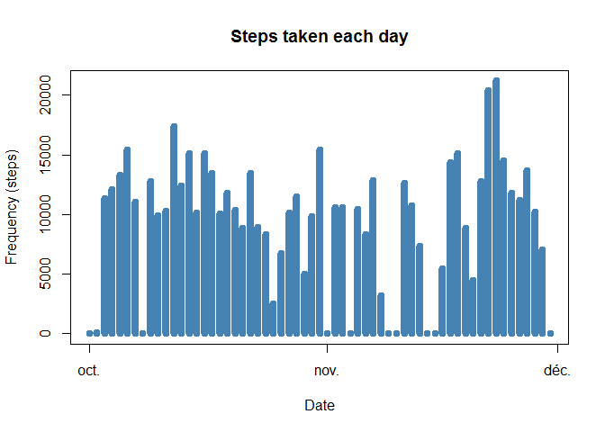
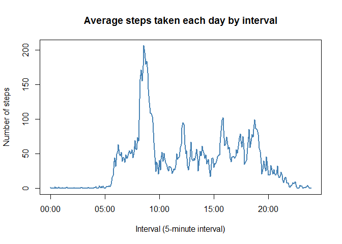
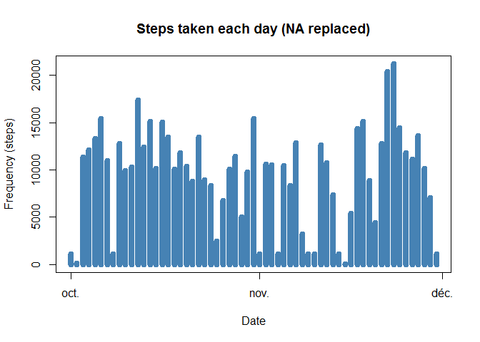
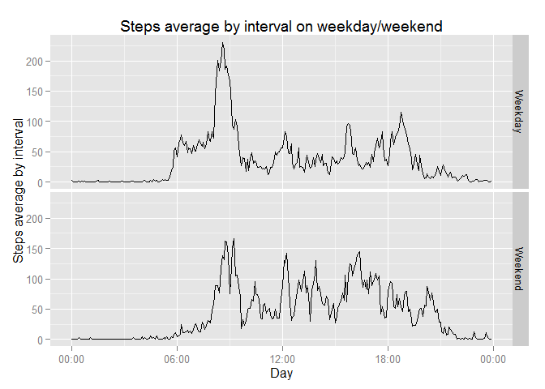

# Reproducible Research  
## Peer assessment 1  
*By Pixel81*  
*Creation date: "2015.07.13"* 

================================================================================

This document is a reproducible research made in the Coursera class
*'Reproducible research'*.  
It is available on my GitHub account ([link](https://github.com/Pixel81/RepData_PeerAssessment1)). 

### Prelimenary actions
First we load the libraries used in this program.

```r
library(ggplot2)
library(plyr)
library(scales)
library(knitr)
```
In order to be readable, echo is set on true. 

```r
opts_chunk$set(echo = TRUE, results = "show")
```

### Introduction
*The introduction is replied from the topic of the assignement.*  
It is now possible to collect a large amount of data about personal movement using activity monitoring devices such as a Fitbit, Nike Fuelband, or Jawbone Up. These type of devices are part of the "quantified self" movement - a group of enthusiasts who take measurements about themselves regularly to improve their health, to find patterns in their behavior, or because they are tech geeks. But these data remain under-utilized both because the raw data are hard to obtain and there is a lack of statistical methods and software for processing and interpreting the data.

This assignment makes use of data from a personal activity monitoring device. This device collects data at 5 minute intervals through out the day. The data consists of two months of data from an anonymous individual collected during the months of October and November, 2012 and include the number of steps taken in 5 minute intervals each day.

### Data

The data for this assignment can be downloaded from the course web site:

**Dataset**: [Activity monitoring data](https://d396qusza40orc.cloudfront.net/repdata%2Fdata%2Factivity.zip) [52K]
The variables included in this dataset are:

**steps**: Number of steps taking in a 5-minute interval (missing values are coded as NA)

**date**: The date on which the measurement was taken in YYYY-MM-DD format

**interval**: Identifier for the 5-minute interval in which measurement was taken

The dataset is stored in a comma-separated-value (CSV) file and there are a total of 17,568 observations in this dataset.

### I - Loading and preprocessing the data

To well work, all the work is done in the R Markdown file folder. The zip file
need to be download in this folder to properly work.  
First, we unzip the data from the zip file and load it into a variable.

```r
if(!file.exists('activity.csv')){ 
        unzip('repdata-data-activity.zip') 
        } # Unzip file
activity <- read.csv('activity.csv') # Load data in variable
```

We make a summary to have a quick overview of the file content.

```r
summary(activity)
```

```
##      steps                date          interval     
##  Min.   :  0.00   2012-10-01:  288   Min.   :   0.0  
##  1st Qu.:  0.00   2012-10-02:  288   1st Qu.: 588.8  
##  Median :  0.00   2012-10-03:  288   Median :1177.5  
##  Mean   : 37.38   2012-10-04:  288   Mean   :1177.5  
##  3rd Qu.: 12.00   2012-10-05:  288   3rd Qu.:1766.2  
##  Max.   :806.00   2012-10-06:  288   Max.   :2355.0  
##  NA's   :2304     (Other)   :15840
```

To correctly interpretate **date**, we convert it with the **POSIXct** function. We also add we create a **time** variable for further plottting series.  
Finaly, a **date.time** variable adding the interval of 5 minutes in the date stream.  

```r
activity$date <- as.POSIXct(activity$date,format='%Y-%m-%d',tz='GMT')
time <- formatC(activity$interval / 100, 2, format='f')
activity$time <- as.POSIXct(time,format='%H.%M',tz='GMT')
activity$date_time <- as.POSIXct(paste(activity$date, time),
                                 format='%Y-%m-%d %H.%M',
                                 tz='GMT')
```

Just take a look at our new content of activity (optional).

```r
head(activity)
```

```
##   steps       date interval                time           date_time
## 1    NA 2012-10-01        0 2015-07-19 00:00:00 2012-10-01 00:00:00
## 2    NA 2012-10-01        5 2015-07-19 00:05:00 2012-10-01 00:05:00
## 3    NA 2012-10-01       10 2015-07-19 00:10:00 2012-10-01 00:10:00
## 4    NA 2012-10-01       15 2015-07-19 00:15:00 2012-10-01 00:15:00
## 5    NA 2012-10-01       20 2015-07-19 00:20:00 2012-10-01 00:20:00
## 6    NA 2012-10-01       25 2015-07-19 00:25:00 2012-10-01 00:25:00
```

### II - What is mean total number of steps taken per day ?
**1. Calculate the total number of steps taken per day.**  
To sum steps per day, we use the ddply function, summarising steps per date.

```r
total_steps <- ddply(activity, ~date, summarise, steps = sum(steps))
```

**2. Make a histogram of the total number of steps taken each day.**  
To plot an histogram, we use the ggplot library. The object is to create an histogram of total steps per day (x-axis), and see how many days are on each frequency (y-axis).

To optimize the histogram, we calculate the binwidth based on the range of the steps per day (max - min), and divided it by 10 (classes).

```r
binwidth <- ( max(range(total_steps$steps,na.rm = TRUE))
                - min(range(total_steps$steps,na.rm = TRUE)) 
                )/10
```

Then we create the histogram with his parameters.

```r
g1 <- ggplot(total_steps, aes(steps))
g1 <- g1 + geom_histogram(fill = "blue",
                          color="steelblue",
                          binwidth = binwidth) 
g1 <- g1 + labs(title = "Steps taken per day")
g1 <- g1 + xlab("Steps per day") 
g1 <- g1 + ylab("Number of days (frequency)")
g1 <- g1 + scale_y_discrete(breaks = seq(0,20,2))
g1
```

 

**3. Calculate and report the mean and median of the total number of steps taken per day.**  
We calculate the two indicators using **mean** and **median** function.

```r
mean_steps <- format(mean(total_steps$steps,na.rm = TRUE), 
                     digits = 0,
                     scientific = FALSE)
median_steps <- format(median(total_steps$steps,na.rm = TRUE),
                       digits = 0,
                       scientific = FALSE)
```

The average is **10766** and the median is **10765**.

### III - What is the average daily activity pattern ?
**1. Make a time series plot (i.e. type = "l") of the 5-minute interval (x-axis) and the average number of steps taken, averaged across all days (y-axis).**

First we split data by **interval** for all days and calculate the **mean** by interval.

```r
interval <- split(activity$steps, activity$interval)
interval_mean <- sapply(interval, mean, na.rm = TRUE)
```

Then we plot the **interval_mean** data series to obtain the time series graphic.

```r
plot(unique(activity$time),
     interval_mean,
     main = "Average steps taken each day by interval",
     xlab = "Interval (5-minute interval)",
     ylab = "Number of steps",
     type = "l",
     lwd = 2,
     col = "steelblue")
```

 

**2. Which 5-minute interval, on average across all the days in the dataset, contains the maximum number of steps ?**  
To obtain the interval, we calculate the maximum of steps by interval. Then we identify the index of the value, and take the value of this interval.

```r
max_Interval <- max(interval_mean)
max_Index <- (which(interval_mean == max_Interval))
Interval_value <- activity$interval[max_Index]
Hour_value <- activity$time[max_Index]
```
The 5-minute interval containing the maximum of steps on average across alldays is the **104**th row, with an interval value of **835** (**08:35**), with an average of **206** steps.

### IV - Imputing missing values
**1. Calculate and report the total number of missing values in the dataset (i.e. the total number of rows with NAs).**

In order to calculate the NA rows, we use the **is.na** function.

```r
NA_number <- sum(as.numeric(is.na(activity$steps)))
```
In this data set, there are **2304** NA values.

**2. Devise a strategy for filling in all of the missing values in the dataset. The strategy does not need to be sophisticated. For example, you could use the mean/median for that day, or the mean for that 5-minute interval, etc.**

In order to not alterate the set value, our choice is to replace NA values by the 5-minutes interval average.  
We calculate the mean steps by interval. This vector will be applied on NA values.

```r
interval_mean <- tapply(activity$steps, activity$interval, mean, na.rm = TRUE)
```

**3. Create a new dataset that is equal to the original dataset but with the missing data filled in.**  
We create a copy of the data set to work on NA values and add the steps median vector.

```r
activity_2 <- activity
activity_2$steps.median <- interval_mean
```

Then we replace all NA values by the mean corresponding value.

```r
for (i in which(is.na(activity_2))) {activity_2[i,1] <- activity_2[i,6]}
```

**4. Make a histogram of the total number of steps taken each day and Calculate and report the mean and median total number of steps taken per day. Do these values differ from the estimates from the first part of the assignment? What is the impact of imputing missing data on the estimates of the total daily number of steps ?**  
First we calculate total steps per day.

```r
total_steps_2 <- ddply(activity_2, ~date, summarise, steps = sum(steps))
```

Like the first histogram, we calculate the binwidth by dividing the total steps by day range by 10.

```r
binwidth_2 <- ( max(range(total_steps_2$steps,na.rm = TRUE))
                - min(range(total_steps_2$steps,na.rm = TRUE)) 
                )/10
```

Then we make the new histogram with NA replaced.

```r
g2 <- ggplot(total_steps_2, aes(steps))
g2 <- g2 + geom_histogram(fill = "darkblue",
                          color="steelblue",
                          binwidth = binwidth_2) 
g2 <- g2 + labs(title = "Steps taken per day (NA replaced)")
g2 <- g2 + xlab("Steps per day") 
g2 <- g2 + ylab("Number of days (frequency)")
g2 <- g2 + scale_y_discrete(breaks = seq(0,20,2))
g2
```

 

And we calculate the new value of median and mean.

```r
mean_steps_2 <- format(mean(total_steps_2$steps,na.rm = TRUE), 
                     digits = 0,
                     scientific = FALSE)
median_steps_2 <- format(median(total_steps_2$steps,na.rm = TRUE),
                         digits = 0,
                         scientific = FALSE)
```
The average is **10766** and the median is **10766**.  
The average is neutral (previous value: **10766**), on median it's insignificant (previous value: **10765**).

### V - Are there differences in activity patterns between weekdays and weekends ?
**1. Create a new factor variable in the dataset with two levels - "weekday" and "weekend" indicating whether a given date is a weekday or weekend day.**

We use the weekdays() function to split days in two different classes, weekday and weekend. This split is put in a new variable, day_type.  
First we duplicate date variable into day_type variable.

```r
activity_2$day_type <- activity_2$date
```

Then we create a function to convert day_type into a two-classes variable.

```r
weeksplit <- function(date) {
        day <- weekdays(date)
        if (day %in% c("samedi", "dimanche")) 
        return("Weekend") else return("Weekday")
        }
```

And then we applied this function at the day_type variable.

```r
activity_2$day_type <- sapply(activity_2$date, FUN = weeksplit)
```
        
**2. Make a panel plot containing a time series plot (i.e. type = "l") of the 5-minute interval (x-axis) and the average number of steps taken, averaged across all weekday days or weekend days (y-axis). See the README file in the GitHub repository to see an example of what this plot should look like using simulated data.**

To create this plot, we need to aggregate steps factoring the day_type variable.

```r
steps_avg <- aggregate(steps ~ time + day_type, data = activity_2, mean)
```

And then we make the plot.

```r
g3 <- ggplot(steps_avg, aes(time, steps))
g3 <- g3 + geom_line() 
g3 <- g3 + labs(title = "Steps average by interval on weekday/weekend")
g3 <- g3 + xlab("Day") 
g3 <- g3 + ylab("Steps average by interval")
g3 <- g3 + facet_grid(day_type ~ .)
g3 <- g3 + scale_x_datetime(labels = date_format(format = "%H:%M"))
g3
```

 

With this plot, we can observ that the pattern is quit different between weekdays and weekend.

================================================================================
