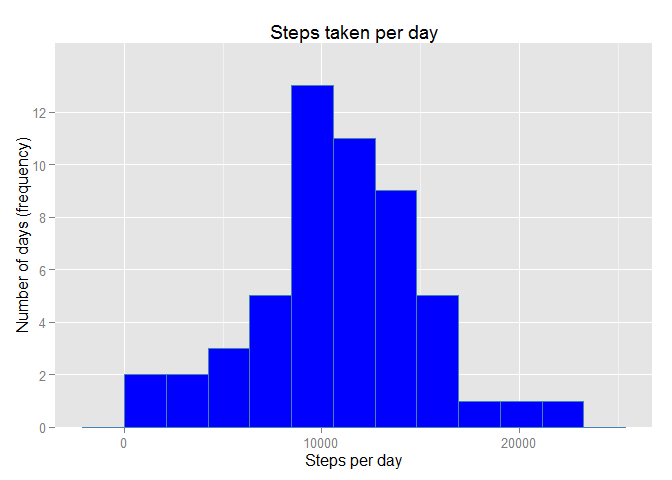
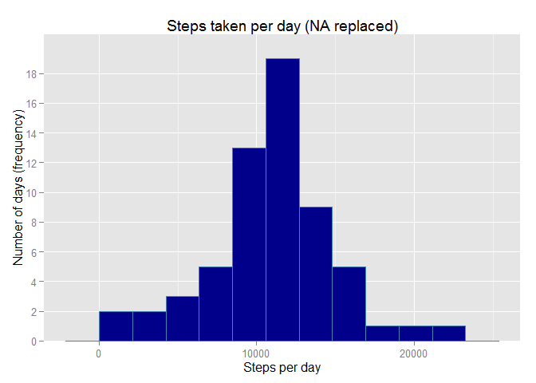

# Reproducible Research  
## Peer assessment 1  
*By Pixel81*  
*Creation date: "2015.07.13"* 
*Last update: "2015.07.15"* 
================================================================================

This document is a reproducible research made in the Coursera class
*'Reproducible research'*.  
In order to be readable, echo is set on true for all the code.

### I - Loading and preprocessing the data

To well work, all the work is done in the R Markdown file folder. The zip file
need to be download in this folder to properly work.  
First, we unzip the data from the zip file and load it into a variable.

```r
if(!file.exists('activity.csv')){ 
        unzip('repdata-data-activity.zip') 
        } # Unzip file
activity <- read.csv('activity.csv') # Load data in variable
```

We make a summary to have a quick overview of the file content.

```r
summary(activity)
```

```
##      steps                date          interval     
##  Min.   :  0.00   2012-10-01:  288   Min.   :   0.0  
##  1st Qu.:  0.00   2012-10-02:  288   1st Qu.: 588.8  
##  Median :  0.00   2012-10-03:  288   Median :1177.5  
##  Mean   : 37.38   2012-10-04:  288   Mean   :1177.5  
##  3rd Qu.: 12.00   2012-10-05:  288   3rd Qu.:1766.2  
##  Max.   :806.00   2012-10-06:  288   Max.   :2355.0  
##  NA's   :2304     (Other)   :15840
```

To correctly interpretate **date**, we convert it with the **POSIXct** function. We also add we create a **time** variable for further plottting series.  
Finaly, a **date.time** variable adding the interval of 5 minutes in the date stream.  

```r
activity$date <- as.POSIXct(activity$date,format='%Y-%m-%d',tz='GMT')

time <- formatC(activity$interval / 100, 2, format='f')
activity$time <- as.POSIXct(time,format='%H.%M',tz='GMT')

activity$date_time <- as.POSIXct(paste(activity$date, time),
                                 format='%Y-%m-%d %H.%M',
                                 tz='GMT')
```

Just take a look at our new content of activity (optional).

```r
head(activity)
```

```
##   steps       date interval                time           date_time
## 1    NA 2012-10-01        0 2015-07-16 00:00:00 2012-10-01 00:00:00
## 2    NA 2012-10-01        5 2015-07-16 00:05:00 2012-10-01 00:05:00
## 3    NA 2012-10-01       10 2015-07-16 00:10:00 2012-10-01 00:10:00
## 4    NA 2012-10-01       15 2015-07-16 00:15:00 2012-10-01 00:15:00
## 5    NA 2012-10-01       20 2015-07-16 00:20:00 2012-10-01 00:20:00
## 6    NA 2012-10-01       25 2015-07-16 00:25:00 2012-10-01 00:25:00
```

### II - What is mean total number of steps taken per day ?
**1. Calculate the total number of steps taken per day.**

```r
total_steps <- tapply(activity$steps, activity$date, sum, na.rm=TRUE)
```

**2. Make a histogram of the total number of steps taken each day.**

```r
plot(unique(activity$date),
     total_steps,
     main = "Steps taken each day",
     xlab = "Date",
     ylab = "Frequency (steps)",
     type = "h",
     lwd = 8,
     col = "steelblue")
```

 

**3. Calculate and report the mean and median of the total number of steps taken per day.**  
The mean calculation is rounded to fit on report. We calculate the two indicators using **mean** and **median** function.

```r
mean_steps <- round(mean(total_steps),0)
median_steps <- median(total_steps)
```

The mean is **9354** and the median is **10395**.

### III - What is the average daily activity pattern ?
**1. Make a time series plot (i.e. type = "l") of the 5-minute interval (x-axis) and the average number of steps taken, averaged across all days (y-axis).**

First we split data by **interval** for all days and calculate the **mean** by interval.

```r
interval <- split(activity$steps, activity$interval)
interval_mean <- sapply(interval, mean, na.rm = TRUE)
```

Then we plot the **interval_mean** data series to obtain the time series graphic.

```r
plot(unique(activity$time),
     interval_mean,
     main = "Average steps taken each day by interval",
     xlab = "Interval (5-minute interval)",
     ylab = "Number of steps",
     type = "l",
     lwd = 1,
     col = "steelblue")
```

 

**2. Which 5-minute interval, on average across all the days in the dataset, contains the maximum number of steps ?**

```r
max_Interval <- max(interval_mean)
max_Index <- (which(interval_mean == max_Interval))
Interval_value <- activity$interval[max_Index]
Hour_value <- activity$time[max_Index]
```
The 5-minute interval containing the maximum of steps on average across alldays is the **104**th row, **835** minutes (around **08:35**), with an average of **206** steps.

### IV - Imputing missing values
**1. Calculate and report the total number of missing values in the dataset (i.e. the total number of rows with NAs).**

In order to calculate the NA rows, we use the **is.na** function.

```r
NA_number <- sum(as.numeric(is.na(activity$steps)))
```
In this data set, there are **2304** NA values.

**2. Devise a strategy for filling in all of the missing values in the dataset. The strategy does not need to be sophisticated. For example, you could use the mean/median for that day, or the mean for that 5-minute interval, etc.**

In order to not alterate the set value, our choice is to replace NA values by the 5-minutes interval median.  
We calculate the median steps by interval. This vector will be applied on NA values.

```r
interval_median <- tapply(activity$steps, activity$interval, median, na.rm = TRUE)
```

**3. Create a new dataset that is equal to the original dataset but with the missing data filled in.**  
We create a copy of the data set to work on NA values and add the steps median vector.

```r
activity_2 <- activity
activity_2$steps.median <- interval_median
```

Then we replace all NA values by the median corresponding value.

```r
for (i in which(is.na(activity_2))) {activity_2[i,1] <- activity_2[i,6]}
```

**4. Make a histogram of the total number of steps taken each day and Calculate and report the mean and median total number of steps taken per day. Do these values differ from the estimates from the first part of the assignment? What is the impact of imputing missing data on the estimates of the total daily number of steps ?**
First we calculate total steps per day.

```r
total_steps_2 <- tapply(activity_2$steps, activity_2$date, sum, na.rm=TRUE)
```

Then we make the new histogram with NA replaced.

```r
plot(unique(activity_2$date),
     total_steps_2,
     main = "Steps taken each day (NA replaced)",
     xlab = "Date",
     ylab = "Frequency (steps)",
     type = "h",
     lwd = 8,
     col = "steelblue")
```

 

And we calculate the new value of median and mean.

```r
mean_steps_2 <- round(mean(total_steps_2),0)
median_steps_2 <- median(total_steps_2)
```
The mean is **9504** and the median is **10395**. The impact on average is lightly increasing (**150**), on median it's neutral (**0**).

### V - Are there differences in activity patterns between weekdays and weekends ?
**1. Create a new factor variable in the dataset with two levels - "weekday" and "weekend" indicating whether a given date is a weekday or weekend day.**


**2. Make a panel plot containing a time series plot (i.e. type = "l") of the 5-minute interval (x-axis) and the average number of steps taken, averaged across all weekday days or weekend days (y-axis). See the README file in the GitHub repository to see an example of what this plot should look like using simulated data.**

